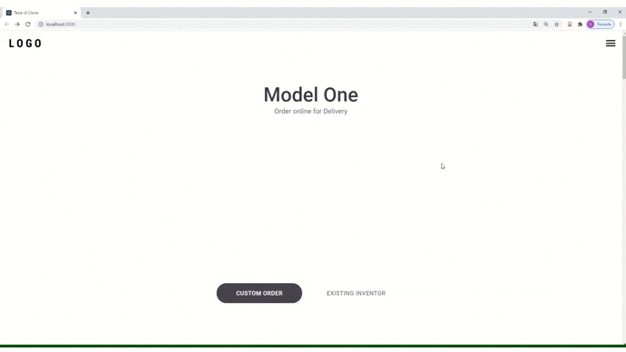

# Tesla UI Clone Concepts

<p> Programming useContext concepts based on Tesla's homepage. </p>

Images were not placed due to copyright

# Installation

Clone this repository:
```bash
git clone https://github.com/diegobonagurio/tesla-ui-clone
```

Enter the folder:
```bash
cd tesla-ui-clone
```

Run the command yarn to install the dependencies and run for execute the application
```bash
yarn start
``` 

# Look The Result


